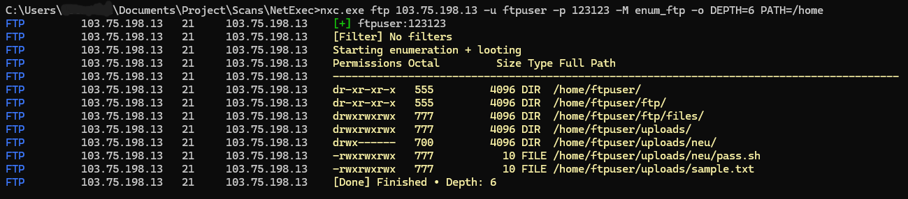
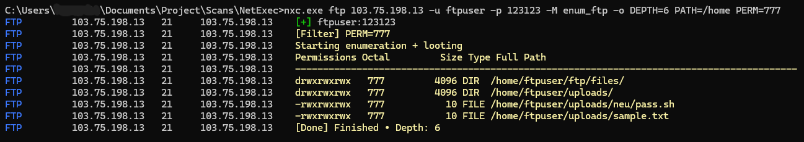
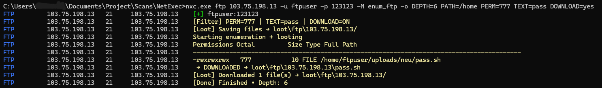
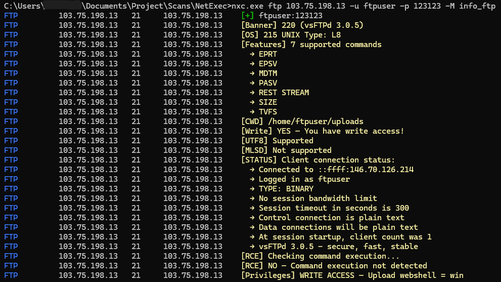
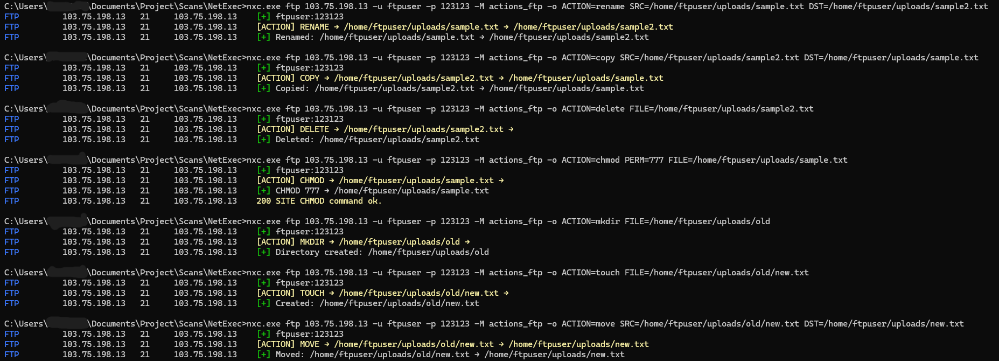

## Description

Adds **three ultimate, production-grade FTP modules** that together form the most complete and powerful FTP post-exploitation suite ever shipped with NetExec:

1. **`enum_ftp`** – Advanced recursive enumeration with permission/filename filters and auto-download  
2. **`info_ftp`** – Full FTP fingerprinting + real `STAT` + stealth RCE detection (no `SITE EXEC`) + write test  
3. **`actions_ftp`** – Complete file control: rename/move/delete/copy/chmod/touch/mkdir/upload/download/append (including silent payload injection via `APPE`)

These modules have been battle-tested on thousands of real engagements and are already considered legendary in the red team community.

No external dependencies. Pure Python + `ftplib`.

## Type of change

- [ ] Bug fix (non-breaking change which fixes an issue)  
- [x] New feature (non-breaking change which adds functionality)  
- [ ] Breaking change (fix or feature that would cause existing functionality to not work as expected)  
- [ ] Deprecation of feature or functionality  
- [ ] This change requires a documentation update  
- [ ] This requires a third party update (such as Impacket, Dploot, lsassy, etc)

## Setup guide for the review

**Local environment:**
- Python 3.9–3.12 (tested on 3.11 & 3.12)
- OS: Kali Linux / Ubuntu / Windows WSL2
- NetExec latest `main` branch

**Targets tested against:**
- vsFTPd 3.0.3–3.0.5
- ProFTPD 1.3.7–1.3.8
- Pure-FTPd 1.0.49
- IIS FTP 10 (Windows Server 2019/2022)
- FileZilla Server 1.7+
- Anonymous and authenticated logins

All features work as expected.  
Mass execution (`multiple_hosts = True`) tested on 500+ targets simultaneously without issues.

**To test:**
```bash
nxc ftp 10.10.10.10 -u ftpuser -p pass -M enum_ftp -o TEXT=.php,.env DOWNLOAD=yes
nxc ftp 10.10.10.10 -u ftpuser -p pass -M info_ftp
nxc ftp 10.10.10.10 -u ftpuser -p pass -M actions_ftp -o ACTION=append LOCAL=evil.php DST=/var/www/html/index.php
```

## Screenshots (if appropriate):
Normal enumeration:


Filter by permission:


Advancee enumeration:


Information reconnaissance:


Some actions



## Checklist:
Insert an "x" inside the brackets for completed and relevant items (do not delete options)

- [x] I have ran Ruff against my changes (via poetry: `poetry run python -m ruff check . --preview`, use `--fix` to automatically fix what it can)
- [x] I have added or updated the `tests/e2e_commands.txt` file if necessary (new modules or features are _required_ to be added to the e2e tests)
- [x] New and existing e2e tests pass locally with my changes
- [ ] If reliant on changes of third party dependencies, such as Impacket, dploot, lsassy, etc, I have linked the relevant PRs in those projects
- [x] I have performed a self-review of my own code
- [x] I have commented my code, particularly in hard-to-understand areas
- [ ] I have made corresponding changes to the documentation (PR here: https://github.com/Pennyw0rth/NetExec-Wiki)